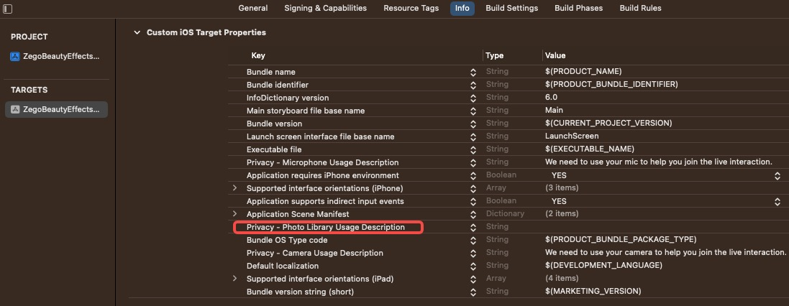
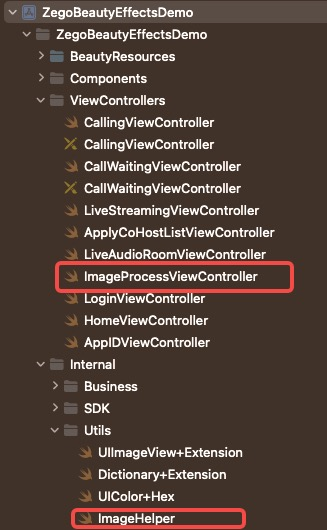

# Effect Picture beauty

### SDK Core interface

1. Core interface

​	 This is done by calling the SDK 'processImageBuffer' interface

### iOS

1. Project configuration

   

   

   

2. Core code file




3. Image beauty logic mainly implemented in these two files, ` ImageProcessViewController ` page interactive logic implementation, ` ImageHelper ` image processing logic implementation


```swift
func imagePickerController(_ picker: UIImagePickerController, didFinishPickingMediaWithInfo info: [UIImagePickerController.InfoKey : Any]) {
  picker.dismiss(animated: true)
  if let selectedImage = info[UIImagePickerController.InfoKey.originalImage] as? UIImage {
      imageForProcessing = selectedImage
      ZegoSDKManager.shared.beautyService.uninitEnv()
      ZegoSDKManager.shared.beautyService.initEnv(selectedImage.size)
  }
}
```


```swift
func renderImage() {
  guard let imageForProcessing = imageForProcessing else { return }
  print("Processing image...");
  let newBuffer: CVPixelBuffer? = ImageHelper.CVPixelBufferRefFromUiImage(imageForProcessing)
  guard let newBuffer = newBuffer else { return }
  ZegoSDKManager.shared.beautyService.processImageBuffer(newBuffer)

  DispatchQueue.main.async {
      let cimage: CIImage = CIImage(cvPixelBuffer: newBuffer)
      let image: UIImage = UIImage(ciImage: cimage)
      self.ZegoImagePreview.image = image
  }
}
```


```swift
@IBAction func saveButtonClick(_ sender: UIButton) {
  guard let effectImage = ZegoImagePreview.image else { return }
  let cgImage: CGImage? = CIContext().createCGImage(effectImage.ciImage!, from: effectImage.ciImage!.extent) ?? nil
  guard let cgImage = cgImage else { return }
  let saveImage: UIImage = UIImage(cgImage: cgImage)
  UIImageWriteToSavedPhotosAlbum(saveImage, self, #selector(saveFinish), nil)
 }
```


### Effect display


