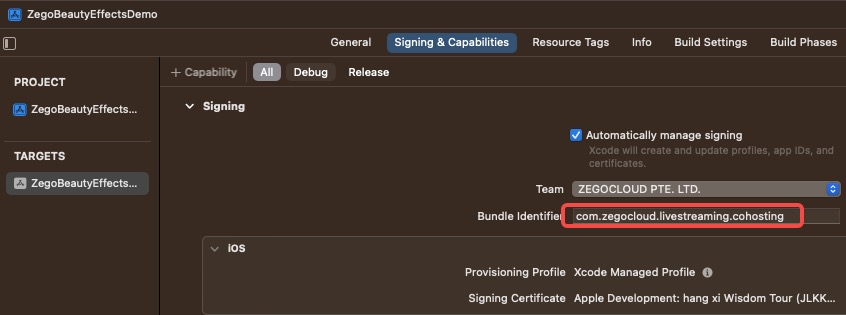
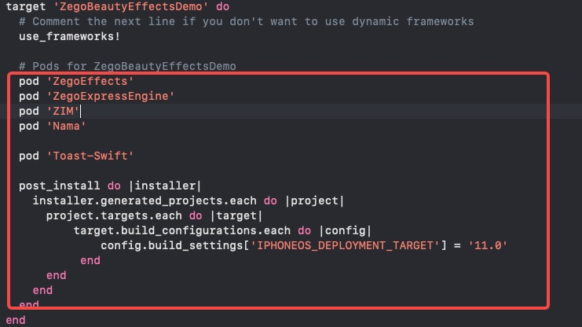
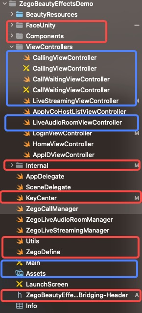
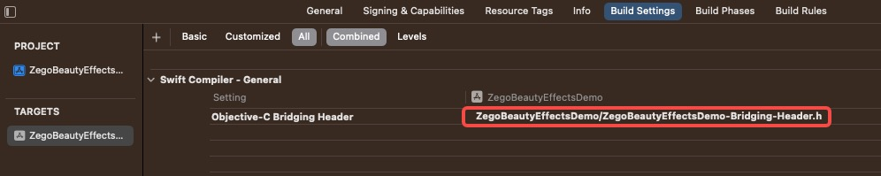

# ZEGOCLOUD & Faceunity

-----

# 1. Run the demo project

## 1.1 Download Demo

Run this command to download the demo

```base
git clone https://github.com/ZEGOCLOUD/zego_beauty_effects_demo_ios.git -b feature/faceunity --depth 1
```

## 1.2 Use your own faceunity license

  - Replace these files with your authpack.h files.
    `ZegoBeautyEffectsDemo/ZegoBeautyEffectsDemo/FaceUnity/authpack.h`
        

  - Fill in your appid and appsign to `KeyCenter.swift`

## 1.3 Use the bundleID corresponding to your license 

you need to replace it.



## 1.4 Configuration completed, now you can run `flutter run` to start. 

Please use a real device for debugging. The beauty demo does not support simulators.


# 2. How to integrate it into your own project

## 2.1 The code structure of the Demo is as follows.

Before we start, let me introduce the structure of the demo.

```bash
.
├── AppDelegate.swift
├── Assets.xcassets
├── Base.lproj
├── BeautyResources
├── Components
├── FaceUnity
├── Info.plist
├── Internal
├── KeyCenter.swift
├── SceneDelegate.swift
├── Utils.swift
├── ViewControllers
├── ZegoBeautyEffectsDemo-Bridging-Header.h
├── ZegoCallManager.swift
├── ZegoDefine.swift
├── ZegoLiveAudioRoomManager.swift
└── ZegoLiveStreamingManager.swift
```

- KeyCenter.swift - You need to fill in your appid and appsign to this file
- `components` - UI components used in the demo.
- `FaceUnity` - The main logic code and UI of Faceunity
- `internal` - Best practice encapsulation of ZEGOCLOUD SDK, try not to modify the code here (if there are bug fixes in the demo, we will update it here, and you should strive to keep the code here consistent with our demo to facilitate easier updates).
- `ZegoLiveStreamingManager.swift` - ZEGOCLOUD implements live streaming scenes, including methods such as joining and leaving rooms, co-hosting, PK, etc. Please refer to `pages/live_streaming` for specific usage instructions.
- `ZegoLiveAudioRoomManager.swift`- ZEGOCLOUD implements the scene of a live audio room (voice chat room), including methods such as joining and leaving the room, taking and leaving the seat, locking the seats, and switching seats, etc. Please refer to pages/audio_room for specific usage methods.
- `ZegoCallManager.swift`- ZEGOCLOUD implements the scene of a video/audio call, including methods such as joining and leaving the call, switch camera, enable speaker, etc. Please refer to pages/call for specific usage methods.
- `ViewControllers` You can refer to the code in this folder to build your own page, which contains the initialization process and page jump logic.

## 2.2 Integration guide

### 2.2.1 add sdk dependency  and Run `pod install`



### 2.2.2 Copy files into your project

- You need to copy the red part files to your project
- And the blue part is optional:
  - If you need live streaming, you will need `LiveStreamingViewController.swift` and  `ZegoLiveStreamingManager.swift`
  - If you need live audio room, you will need `LiveAudioRoomViewController.swift` and  `ZegoLiveAudioRoomManager.swift`
  - If you need call, you will need `CallingViewController.swift` `CallWaitingViewController.swift` and  `ZegoCallManager.swift`




### 2.2.3 Set `Objective-C Bridging Header`




### 2.2.4 Use them in your code

#### 2.2.4.1 init sdk and connect user

You need to initialize the SDK using the `init` method and call the `connectUser` method to connect the user when they login. ( Please refer to `LoginViewController.swift` for specific usage instructions.)

You can put this logic in your user's login button, or call these two methods when the user successfully logs in through cache. For example:

```swift
override func viewDidLoad() {
  super.viewDidLoad()
    // Do any additional setup after loading the view.
    //...
		ZegoSDKManager.shared.initWith(appID: appID, appSign: appSign)
}

@IBAction func loginAction(_ sender: UIButton) {
    let userID = userIDTextField.text ?? "123"
    let userName = userNameTextField.text ?? "Tina"

    // save user id and user name.
    UserDefaults.standard.set(userID, forKey: "userID")
    UserDefaults.standard.set(userName, forKey: "userName")

    ZegoSDKManager.shared.connectUser(userID: userID, userName: userName) { code , message in
    if code == 0 {
      self.performSegue(withIdentifier: "login", sender: sender)
    } else {
      self.view.makeToast("zim login failed:\(code)", duration: 2.0, position: .center)
    }                                                                    }
}
```

#### 2.2.4.2 Navigate to the livePage

After ensuring successful user login, you can freely use `LiveStreamingViewController.swift` at any time.

```swift
override func prepare(for segue: UIStoryboardSegue, sender: Any?) {
  super.prepare(for: segue, sender: sender)
  if let liveVC = segue.destination as? LiveStreamingViewController {
    liveVC.isMySelfHost = segue.identifier! == "start_live"
    liveVC.liveID = liveIDTextField.text ?? ""
  }
  //...
}
```

# 3. How to adjust the beauty parameters

- Please read the code in `FUManager`  `FaceUnityManager.swift` and `BeautySliderManager.swift`
  - Use `FaceUnityManager.shared.enableFaceUnity()` to initialize faceunity.
  - Use `BeautySliderManager`  to show up the beauty menu.
  - Use `FUManager` to modify the beauty parameters.'
  - Use `FaceUnityManager.shared.disableFaceUnity()` to deinitialize faceunity.


# 4. more features

If you need to expand more features, please make sure to read the following content to understand the basic operation mechanism and extend the functionality of FaceUnity.

- The specific implementation of the faceunity can be found in `FUManager` 

- For More faceunity features, please refer to the official documentation of [faceunity](www.faceunity.com).