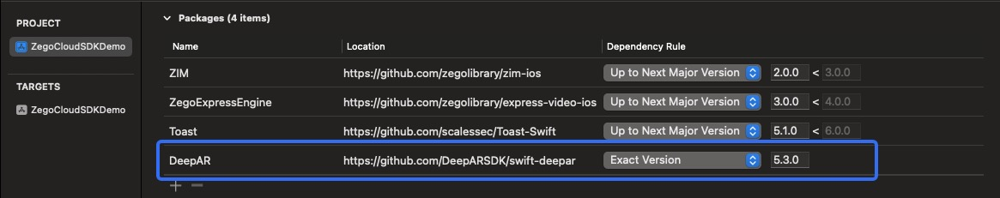
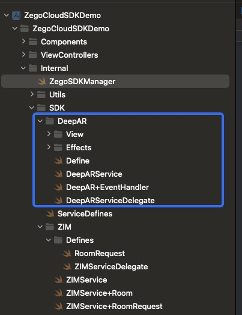

1. Add `DeppAR` dependency

   

2. Copy the `DeepAR` folder to your project.

   

   

3. Obtain DeepAR license

   > Please refer to the official documentation of DeepAR at https://docs.deepar.ai/deepar-sdk/platforms/ios/getting-started.

4. Initializing

   ```swift
   class LoginViewController: UIViewController {
     
     let appID: UInt32 = Your_APP_ID
     let appSign: String = Your_APP_SIGN
     let license: String = Your_License
     
     override func viewDidLoad() {
           super.viewDidLoad()
   				//...
   				ZegoSDKManager.shared.initWith(appID: appID, appSign: appSign, deeparLicenseKey: license)
       		//..
       }
   }
   ```

   

5. How to setting DeepAR Effects

   ```swift
   class LiveStreamingViewController: UIViewController {
     //...
     @IBAction func effectButtonClick(_ sender: Any) {
         DeepARToggleView.show().delegate = self
     }
   }
   
   extension LiveStreamingViewController: DeepARToggleViewDelegate {
    	func deepARToggleViewClick(_ type: Effects) {
           if type == .Effect_Clear {
               ZegoSDKManager.shared.deepARService.disableDeepAR()
           } else if type == .Background_blur {
               ZegoSDKManager.shared.deepARService.backgroundBlur(enable: true, strength: 3)
           } else if type == .Replace_Background_Image {
               ZegoSDKManager.shared.deepARService.backgroundReplacement(enable: true, image: UIImage(named: "call_waiting_bg"))
           } else {
               if let path = type.rawValue.path {
                   ZegoSDKManager.shared.deepARService.switchEffect(slot: "effect", path: path)
               }
           }
       }
   }
   ```

   

6. Remove DeepAR effect

   ```swift
   class LiveStreamingViewController: UIViewController {
     //...
     deinit {
       ZegoSDKManager.shared.deepARService.disableDeepAR()
       //...
   	}
   }
   ```

7. Testing has revealed the following known issues with DeepAR：

 DeepAR new version changeLiveMode set to false will result in initialization failure.

